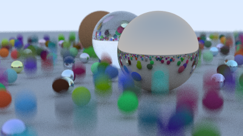

Sample taken from: 

https://raytracing.github.io/books/RayTracingTheNextWeek.html#boundingvolumehierarchies

## Putting Everything Together

The code below takes the example diffuse spheres from the scene at the end of the last book, and makes them move during the image render. Each sphere moves from its center $\mathbf{C}$ at time $t=0$ to $\mathbf{C}+(0,r/2,0)$ at time $t=1$:

```c++
int main() {
    hittable_list world;

    auto ground_material = make_shared<lambertian>(color(0.5, 0.5, 0.5));
    world.add(make_shared<sphere>(point3(0,-1000,0), 1000, ground_material));

    for (int a = -11; a < 11; a++) {
        for (int b = -11; b < 11; b++) {
            auto choose_mat = random_double();
            point3 center(a + 0.9*random_double(), 0.2, b + 0.9*random_double());

            if ((center - point3(4, 0.2, 0)).length() > 0.9) {
                shared_ptr<material> sphere_material;

                if (choose_mat < 0.8) {
                    // diffuse
                    auto albedo = color::random() * color::random();
                    sphere_material = make_shared<lambertian>(albedo);
                    auto center2 = center + vec3(0, random_double(0,.5), 0);
                    world.add(make_shared<sphere>(center, center2, 0.2, sphere_material));
                } else if (choose_mat < 0.95) {
                ...
    }
    ...

    camera cam;

    cam.aspect_ratio      = 16.0 / 9.0;
    cam.image_width       = 400;
    cam.samples_per_pixel = 100;
    cam.max_depth         = 50;

    cam.vfov     = 20;
    cam.lookfrom = point3(13,2,3);
    cam.lookat   = point3(0,0,0);
    cam.vup      = vec3(0,1,0);

    cam.defocus_angle = 0.6;
    cam.focus_dist    = 10.0;

    cam.render(world);
}
```

This gives the following result: 

