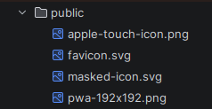

## Screenshot!



```c
int main() {
    printf("Hello, world!");
    return 0;
}
```
so we continue

### h3
#### h4
##### h5
###### h6

1. one
2. two
3. three
4. four
   1. sub-five
   2. sub-six

- Bullet point
  - Sub-bullet point
- [ ] unchecked
- [x] checked

|   |   |   |   |   |
|---|---|---|---|---|
|   |   |   |   |   |
|   |   |   |   |   |
|   |   |   |   |   |


| Name   | Language   | Notes        |
|--------|------------|--------------|
| Tami   | TypeScript | Very neat    |
| Blog   | Markdown   | Now improved |