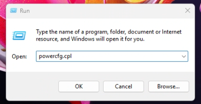
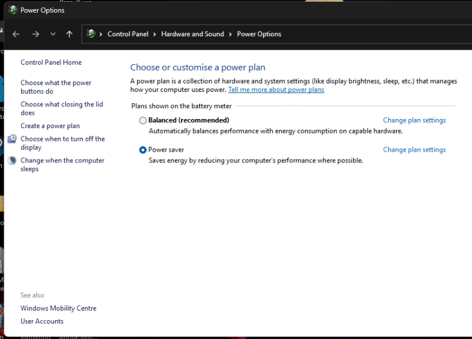
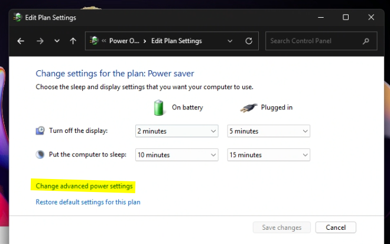
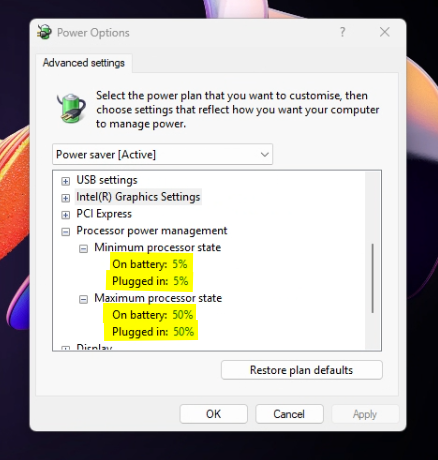
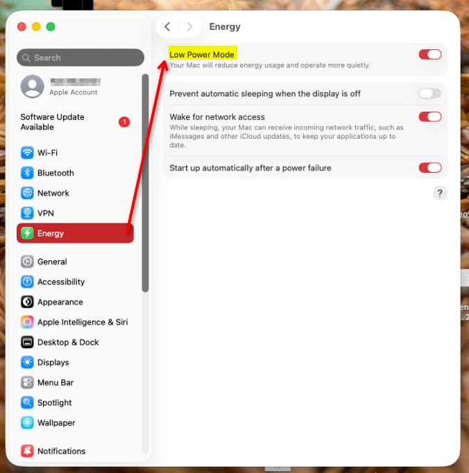
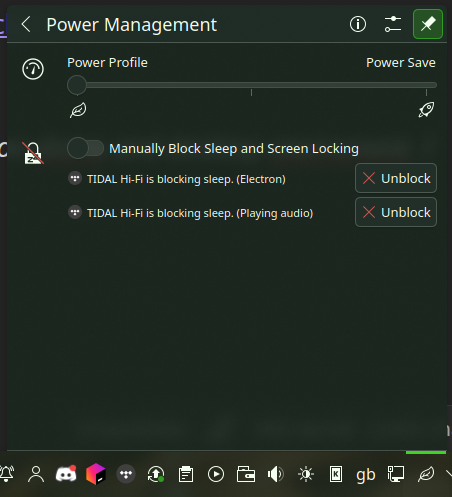
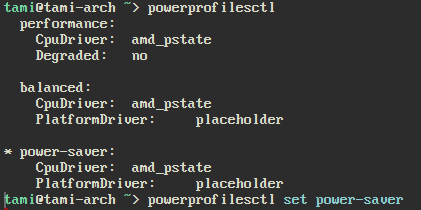

Hi and happy too _hot_ weather! Here are a few tips I've learned over the years.

During summer heatwaves, I generally do not fare well and melt too easily. As I work primarily with computers for both work and recreational areas of my life, I have developed a habit of purposely weakening my systems to help manage the temperature of my home. After all! Computers are just overly complicated space heaters! I hope that this helps somebody out there! <p style="font-size: 8pt">Oh and remember to drink plenty of water!</p>

## Windows
### CPU

- Hit `Win+R`
- In the dialog that comes up, enter `powercfg.cpl` and press enter.
- In the Window that comes up, select _Power Saver_ (On some systems, it may show under a expandable section) 
- For further configuration, select _Change plan settings_ and click _Change advanced power settings_ 
- You will be presented with a new Power Options dialogue with more granular settings. Near the bottom will be _Processor Power management state_ where you can define caps for maximum CPU use. These have the greatest output for thermally restricting thermal output. It becomes a trade off of how much performance you are willing to lose for reduced thermal output
- Start with reducing it from 100% to 75%, 50% etc.  Due to how processors can differ between systems. You may have to go find the right balance for you. Have a play around. Once done, click apply

### GPU (NVIDIA)

- Open up a terminal/cmd/powershell **As administrator**.
- Type `nvidia-smi -pl 10`. It will return an error that will specify the lowest TDP you can set

```text
Provided power limit 10.00 W is not a valid power limit which should be between 100.00 W and 270.00 W for GPU 00000000:26:00.0
Terminating early due to previous errors.
```

  - In my case, 100W is the minimum, so I'd run `nvidia-smi -pl 100`
	  - _Note that this is not persistent between reboots and shutdowns. So repeat this between system starts. It will hold when putting your system into sleep_
	  - _Additionally the exact same instructions apply for Linux/BSD systems using NVIDIA proprietary drivers_

### GPU (AMD)

I don't have a AMD GPU to test with. So I'm using [AMD's website as reference](https://www.amd.com/en/resources/support-articles/faqs/DH3-020.html)
- In AMD Adrenalin, under the GPU tab you should see some presets 
- For the simplest option, click _Undervolt GPU_. 
	- For further control, click _Custom_ and accept the Terms of Service. Then use the Power Tuning slider to your liking if available (what sliders are available may depend on your GPU generation)

---

## MacOS

- Open _System Settings_, go to _Energy_ and enable _Low power mode_. Simples 
- If option is not available, refer to [Apples support article](https://support.apple.com/en-gb/101613)

---

## Linux

_Note that methods in CPU adjustment can vary depending on distro and desktop environment. I run Arch Linux with KDE so steps may vary._

### CPU

- Open the _Power Management_ dialogue from the _System Tray_ widget. drag the slider to _Power Save_ 
- If you'd rather use the command line, use `powerprofilesctl` 
	- _Note that functionality may depend on your CPU and drivers. As I just found out, I did not install the right drivers on my Arch system, so turns out its had no effect! Other distributions will already have this set up properly so this ones on me. Oops!_
- For finer control, use the [cpupower-gui](https://github.com/vagnum08/cpupower-gui#packages) project. Thankfully it is available in many distributions' package manager

### GPU (NVIDIA)

Open up a terminal.
- Type `sudo nvidia-smi -pl 10`. It will return an error that will specify the lowest TDP you can set

```text
Provided power limit 10.00 W is not a valid power limit which should be between 100.00 W and 270.00 W for GPU 00000000:26:00.0
Terminating early due to previous errors.
```

  - In my case, 100W is the minimum, so I'd run `sudo nvidia-smi -pl 100`
	  - _Note that this is not persistent between reboots and shutdowns. So repeat this between system starts. It will hold when putting your system into sleep_
	  - _Additionally the exact same instructions apply for Linux/BSD systems using NVIDIA proprietary drivers_